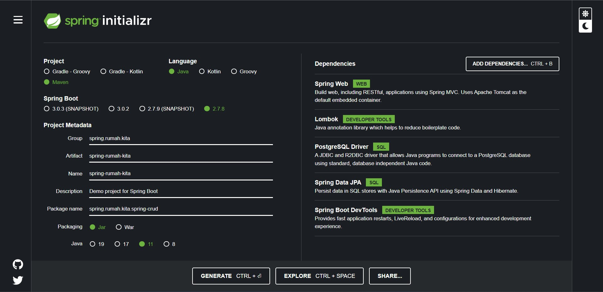

  <h1>Java Spring Postgresql</h1> 
  
Simple REST API java spingboot

🌸Welcome to Java Spring with Postgresql🌸

You can start via start.sping.io

Detail about the port, config database on aplication.properties

